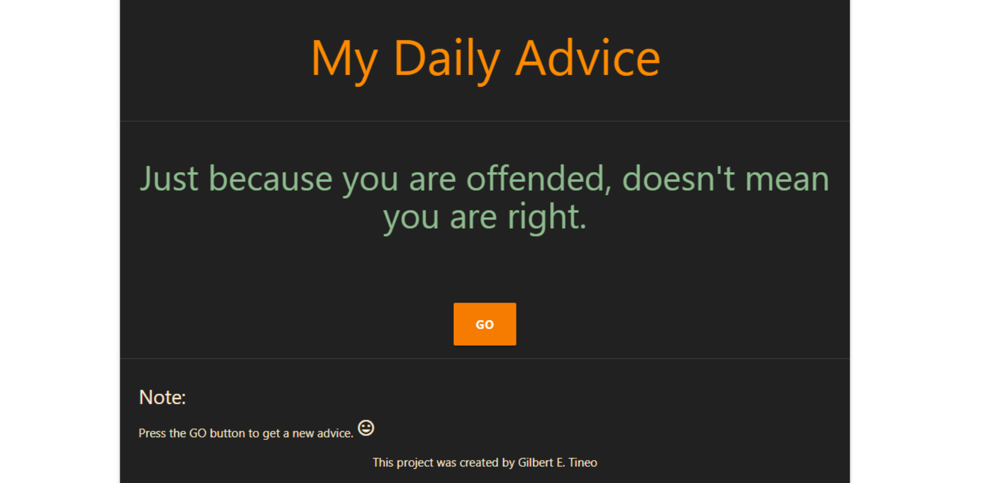

# Consumo básico de API (Advice Slip API)

Consiste en una aplicación web básica, en donde se consume los recursos de https://api.adviceslip.com/ y de manera Random le dá al usuario un consejo cada vez que preciona el botón. "Advice Slip API" es una API pública en donde su función es dar al usuario (Consejos) de manera aleatoría. Actualmente la API cuenta con mas de 200 Frases o consejos para ser consumidos. Su documentación es de facíl uso y de rápida implementación para usos prácticos o de aprendizajes.

It consists of a basic web application, where the resources of https://api.adviceslip.com/ are consumed and Randomly gives the user an advice each time the button is pressed. "Advice Slip API" is a public API where its function is to give the user (Tips) randomly. Currently the API has more than 200 Phrases or tips to be consumed. Its documentation is easy to use and quick to implement for practical or learning uses.

## Heramientas Utilizadas / Used Tools
- Laravel :zap:
- Advice Slip API :satellite:
- Materialize :art:

